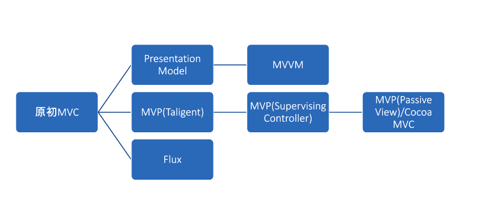

# ２種類のアーキテクチャ
アーキテクチャには大きく分けて２種類ある。ひとつはGUIアーキテクチャであり、UIとドメインの分離（PDS）を実践するためのアーキテクチャパターンである。もうひとつはシステムアーキテクチャであり、GUIアーキテクチャよりも広い範囲、システム全体の構造を指す。

# GUIアーキテクチャ　
GUIアーキテクチャとは、Presentation Domain Separation(PDS)を実践する具体的なレイヤー構造のパターンのことを指す。

PDSとは、それぞれ異なる関心を持つプレゼンテーションとドメインをレイヤーとして切り分けようとする思想のことをいう。PDSのメリットとして、「レイヤーが分割され理解しやすいこと」「適切なレイヤーに適切なコードが書かれ、コードの重複が排除される」「データがUIと分離されることによる、テスタビリティの向上」がある。

MVCやMVP,MVVMとはそれぞれGUIアーキテクチャパターンである。それらが指すModelとはシステム本来の関心＝ドメインに留まらず「プレセンテーションと関係ないもの全て」を意味している。

そのため、GUIアーキテクチャはUIとその他のシステムをどのように分離させるかの知見であり、UIが関わるより先のことは示していない。

## Model-View-Controller
### 原初MVC
当時のGUI開発はフォームにウィジェットを貼り付けるのが一般だった。フォームとはiOSでいうViewControllerのようなもので、レイアウトやUI全体を司る。ウィジェットとはUIコンポーネント（ボタンヤラベル、テーブル）を指す。

当時のコードは直接ウィジェットの中に書かれていた（Fat ViewControllerみたいなもの）。それがよい分割とされていた（ウィジェット内部で何が行われているか気にせずにレイアウトできるため？[要確認]）

しかし1979年、Smalltalk開発に携わった[Reenskaug](https://ja.wikipedia.org/wiki/%E3%83%88%E3%83%AA%E3%82%B0%E3%83%B4%E3%82%A7%E3%83%BB%E3%83%AA%E3%83%BC%E3%83%B3%E3%82%B9%E3%82%AB%E3%82%A6%E3%82%AF)氏が、コードがウィジェットの表示上の都合によってユーザーの[メンタルモデル](https://goodpatch.com/blog/design-mentalmodel/)（アプリケーションが解決すべき問題に対してユーザーが抱いている、「このような構造である」と言う理解）
と乖離することを問題として、UIとメンタルモデルの責務を分離した。

その後変遷を経て、1988年、Model,View,ControllerというアーキテクチャがSmalltalk-80の開発環境に組み込まれる形で完成した。(https://www.ics.uci.edu/~redmiles/ics227-SQ04/papers/KrasnerPope88.pdf)

---
各レイヤーの役割
- Controller
    - ユーザーの入力を受け、Modelにコマンドを送る
- Model
    - コマンドを受けて処理を行い、自身を更新
- View
    - Modelの変更を監視し、自身を更新
---

Modelはユーザーのメンタルモデルであり、それに対応した構造になっていなくてはならない。Modelとは単純なオブジェクトのことではなく、そのオブジェクトをどのように使うのか、と言うロジックや構造もまたModelの一部である。そのようなロジックをModelの外に漏らしてしまうことを、Martin Fowler氏はドメインモデル貧血症と呼ぶ。(https://martinfowler.com/bliki/AnemicDomainModel.html)

Modelは複数のViewやControllerに共有され得るので[要確認]、ModelからViewへの変更通知はObserverパターンによって実現される。

MVCにはいくつかの課題があった。

---

- プレゼンテーションロジックの表現ができない
    - 値に応じて色を変える、など
- プレゼンテーションの状態を保持できない
    - セルの選択状態、など
- テストが難しい
    - Smalltalkの問題

---

それらの課題の解決策として、最も後世に影響を与えたのがPresentation Modelパターンだった。

## Presentaion Modelパターン

---

各レイヤーの役割
- Controller
    - ユーザーの入力を受け、Presentation Modelにコマンドを送る
- Presentaion Model
    - Modelにコマンドを送る
    - Modelの変更を監視する
    - プレゼンテーションロジック
    - 状態管理
- Model
    - コマンドを受けて処理を行い、自身を更新
- View
    - Presentation Modelの変更を監視

---

Presentation Modelパターンでは、View/ControllerとModelの間にPresentation Modelが挟まれる。

例えば、「フォームをすべて埋めると活性するボタン」の変動はModelに関係なく起こるので、そうした状態管理をPresentation Modelが担い、Viewがそれを監視して自身を更新する。

Presentation Modelは1991〜1994年頃には洗練され、Application ModelパターンとしてSmalltalkの後継バージョンに組み入れられた。Application ModelパターンではAspectAdptorなどの仕組みが導入され、ボタンアクションの実行やバリデーションロジックはほとんどがApplication Modelの中に入れられるようになった。(http://wiki.c2.com/?ModelViewControllerHistory)

## Model-View-ViewModel(MVVM)
2005年、Microsoft社のWPF(Windows Presentation Foundation)及びSilverlightアーキテクトだったJohn Gossman氏によってMVVMパターンが提唱された。(https://docs.microsoft.com/ja-jp/archive/blogs/johngossman/introduction-to-modelviewviewmodel-pattern-for-building-wpf-apps)

MVVMは「Presentation ModelをSilverlightプラットフォーム向けに特殊化したもの」とされる。しかしiOSアプリ設計パターン入門の著者は、MVVMに類似するのはApplication Modelではないかと指摘する。

Application ModelとMVVMの構造はほぼ変わらないが、MVVMにはControllerレイヤーが存在しない。また、MVVMはWPF/Silverlightの機能をフル活用している。

MVVMではViewテンプレートをXAML(XMLベースのDSL()=ドメイン固有言語))で宣言する。その宣言に従って実行時にViewとViewModelがバインドされ、コードを書かなくてもViewModelの状態がViewへと反映される。Viewは動的に変更できるため、ViewModelとViewが疎結合になった。

上記で言うMVVMはWPFやSilverlightのプラットフォーム上で動作することが前提であるので、他のプラットフォームでは手動のバインディングコードが必要となる。

Gossman氏は2006年、MVVMは単純なアプリケーションにとってはオーバーエンジニアリングであり、またデータバインディングがメモリ効率に影響を与える可能性がある、と指摘した。今でこそiOSアプリでは一般的なMVVMだが、当時富豪的アーキテクチャとして捉えられていた。

## Model-View-Presenter(MVP)
### MVP(Taligent)
TaligentはAppleとIBMが合同出資した会社であり、そのCTOであるMike Potel氏が1996年、MVPアーキテクチャについての論文を提出した。(http://www.wildcrest.com/Potel/Portfolio/mvp.pdf)

その論文はMVCを様々なプラットフォームや開発環境に適用するために再定義し一般化するものであった。論文ではModel,View,Controllerそれぞれの責務をさらに細かく分類し、Controllerを一般化した存在としてPresenterを置いた。

ここでいうPresenterとは、ウィジェット単位に配置されるControllerとは異なり、アプリケーション全ての入力イベントを管理する、「mainやevent loopの体現者であり、指揮者のような存在」であった。

### MVP(Supervising Controller)
2000年、Dolphin SmalltalkとしてWindows環境に進出したSmalltalkは、MVCではなくMVPを採用した。

---

各レイヤーの役割
- View
    - MVCにおけるControllerの役割を内包
        - ユーザーからの入力を受け取り、コマンドを送る
    - Modelの変更を監視して、自身を更新する
- Presenter
    - Viewからユーザーの入力を受け取り、Modelへ伝える
- Model
    - コマンドを受けて処理を行い、自身を更新

---

PresenterはApplication Modelと異なり、Viewの実態を直接知っている。また、複数Viewを管理し、それらを階層的に取り扱う（iOSでいうViewControllerと同様）。

PresenterがViewを直接操作できる仕組みを指してSupervising Controllerと呼ばれる。(https://www.martinfowler.com/eaaDev/SupervisingPresenter.html)

ここでViewへの状態反映の手段が、PresenterからViewインスタンスを直接更新するフロー同期と、ViewがModelの変更通知を受け取って自身を更新するオブザーバー同期のふたつが存在する。このふたつは一長一短であるが、混在することにより処理の影響が読みづらく、デバッグを困難にしていた。

### MVP(Passive View)
2005年、高いテスタビリティを確保しTDDサイクルを回せるアーキテクチャとして、Micheal Feathersらが論文としてMVP（Passive View）を発表した。(https://atomicobject.com/uploads/archive/files/PF_March2005.pdf)

Passive ViewとはObserver同期をやめたViewである。ViewはModelを監視する役割を捨てて完全に受動的な存在となった。

これはiOSアプリにおけるMVC (Cocoa MVC)と非常に近いものになっている。

### Cocoa MVC
Appleは自身が推奨するMVCアーキテクチャについて、原初MVCを下敷きにしながらその課題を挙げた上で、Model,View,Controllerの関係を以下のように説明する。

> 多くのCocoaアプリケーションでは、モデルオブジェクトの状態が変化すると、その通知やコントローラオブジェクトを経由してビューオブジェクトに伝わります

これは上でのべたMVP(Passive View)と同様のパターンと言える。

## Flux, Redux
2014年、MVCへの批判としてFacebookがFluxというアーキテクチャを提唱した。

単一方向のデータフローというコンセプトにフォーカスしたFluxパターンは原初MVCにも近い構造を持つが、誤解され、亜種が生まれやすいMVCに対して、「単一方向のデータフロー」を前面に押し出したパターンと言える。

ReduxはFluxを発展させ、関数型言語のElmの影響を大きく受けたアーキテクチャである。

##  GUIアーキテクチャまとめ
GUIアーキテクチャは原初MVCを始祖として、そレぞれの課題を解決するために下図のように分岐してきたと言える。

原初MVCにはプレゼンテーションロジックや状態管理が不得手である課題があった。それを解消するべく、Presentation Modelパターンが提唱され、それをWPF/Silverlightに最適化されたものとしてデータバインディングを用いるMVVMが提唱された。

また、原初MVCはSmalltalk環境のアーキテクチャとして定義されていたので、それをクライアン/サーバーシステムなどに一般化して適用しようとしたのがMVP(Taligent)であった。それをさらに発展させ、オブザーバ同期とフロー同期の二種によってViewを更新するような形を取ったのがMVP（Supervising Controller）であった。さらに、更新の経路が複数あるのを嫌い、Viewがあくまで受動的にふるまうMVP(Passive view)が提唱された。Appleが提唱するMVCも、思想的にはMVP(Passive View)に含まれる。

また、原初MVCは誤解され亜種が生まれやすく、データフローが煩雑になるケースが散見されたために、「単一方向のデータフロー」をコンセプトとしたFluxが生まれた。

# システムアーキテクチャ
GUIアーキテクチャがプレゼンテーションとドメインを分離するものであったのに対し、ドメインの先でどのようにレイヤーを切り、システム全体をどのように接合すべきかどうかはシステムアーキテクチャが示している。

## レイヤードアーキテクチャ
Martin Fowler氏によると、レイヤーという概念は90年代のクライアント/サーバーシステムの発展とともに明確となった。(Martin Fowler(2005)『エンタープライズアプリケーションアーキテクチャパターン』)

当初はクライアント・サーバー・DBという物理的な境界に基づくレイヤーだったが、2003年にEric Evans氏が提唱するドメイン駆動設計の影響により、純粋なドメイン知識であるDomain層が確立され、関心によるレイヤー分離も行われた。物理的な切り分け単位をTier,論理的な切り分けをレイヤーと呼び分けることもある。

結果、レイヤーは3層あるいは4層に分離された。

ここで、レイヤーの依存関係は必ず上から下の方向になる。

4層レイヤードアーキテクチャにおいてDomain層を純粋なドメイン知識とするにあたって、Domain層がData層に依存することによって、ドメインのデータ構造が永続化のためのデータ構造に引きずられてしまうことが問題となった。
この問題は、Domain層のテスト（DBの中身を書き換える必要が生まれる）や、Data層の移行が難しくなること、またDomain層に閉じ込めるべきドメイン知識がData層に漏出することも起こった。

それを解決するために導入されたのが、依存関係逆転の原則だった。Domain層は自分自身が使用するための、Data層が従うべきインターフェイスを定義し、Data層がそのインターフェイスに依存することで、Domain層をData層から引き剥がすことができた。

## Hexagonal Acthitecture
Data層に対する依存関係の逆転によってData層⇄ドメイン層は疎結合となったが、同じ問題意識はPresentation層にも表出していた。
そこでPresentationとData層をどちらも「外側」と捉え、六角形を用いでレイヤーを表現したのがHexagonal　Architectureだった。

六角形であることに特に意味はなく、だいたい接続すべきレイヤーは六個以下になる、ということで付けられた名前だったが、のちにPort And Adapters Architectureと呼ばれるようになる。

アプリケーションは外部との接続のため、「目的」の単位で抽象化されたポートを提供している。ポートには外部からアダプタが差し込まれる（GoFのデザインパターンでいうAdapterパターンと同義）。アダプタは差し込まれる外部モジュールの実装を隠蔽し、ポート書き対するインターフェースへ変換する。（例：Model⇄JSON）

ポートにはプライマリポートとセカンダリポートがある。前者は「アプリケーションを駆動する」、後者は「アプリケーションによって駆動される」。アプリケーションを駆動するのはユーザーのインタラクションを受け取るViewであるので、ここではプレゼンテーション層がプライマリーポートであると言える。データ層はアプリケーションによって操作されるので、セカンダリポートであると言える。

## Onion Architecture
2008年、Jeffery Palermo氏によって提案されたOnion Architectureは、Hexagonal Architectureとアイデアは変わらない。Palermo氏によるとOnion Architectureの教義は
- アプリケーションは自立したオブジェクトモデルを取り囲むように作られる
- 内側のレイヤーはインターフェースを定義し、外側のレイヤーはそれを実装する
- 依存の方向は外側から内側
- Application Coreはインフラストラクチャ（Data層）抜きでコンパイル・実行できる

## Clean Architecture
2012年、Uncle Bobが[ブログ記事](https://blog.cleancoder.com/uncle-bob/2012/08/13/the-clean-architecture.html)で提案したのがClean Architectureだった。これは下記のような、近年提案された様々なアーキテクチャのコンセプトを統合するものだった。
- Hexagonal Architecture
- Onion Architecture
- Screaming Architecture[^1]
- Data, Contect and Interaction (DCI)
- Boundary Control Entity(BCE)

いずれも変化の激しい部分からビジネスロジックをいかに切り離して保護するかを異なる視点で捉えたアーキテクチャだった。

これも思想としてはOnion Architectureとほぼ同様のものである。

[^1]: https://blog.cleancoder.com/uncle-bob/2011/09/30/Screaming-Architecture.html

## システムアーキテクチャまとめ
つまるところ、システムアーキテクチャというのはいかにドメインモデルを、プレゼンテーションはデータ永続化の都合から守り切るか、という思想。
結局はインターフェースを定義してドメインを他のレイヤーから疎結合に保とうね、ということ。

# モバイルアプリのアーキテクチャ 画面遷移
## CoordinatorパターンとMVVM-C
2015年、Soroush Khanlou氏が発表したのがCoordinatorパターンだった。（https://www.slideshare.net/secret/3jJlEE1weo0RRl , https://khanlou.com/2015/01/the-coordinator/ ）

Coordinatorはアプリのルートに存在するApplication　Coordinatorを頂点とした階層構造によって画面遷移を表現する。

## RouterパターンとVIPER
Routerパターンを取り入れたアーキテクチャとして有名なのは2013年にMutualMobile社が発表したVIPERである。また、2017年にUber社がリリースしたRIBsアーキテクチャ(https://github.com/uber/RIBs)でも、Routerパターンが採用されている。
VIPERとはView, Interactor, Presenter, Entity, Routingの頭文字で、この5つの部品から構成されている。
VIPERはClean Architecture + MVP + Routerのアーキテクチャと言える。

PresenterがViewへの参照を持ち、直接更新する点はMVP(Passive View)と同様。MutualMobile車はInteractorやPresenterについてPONSO(Plain Old NSOBject: 何も継承しないシンプルな型)であることを強調しているため、それが（MVVMではなく）MVPを採用した理由と考えられる。

## Micro View Controller
2018年にmercari社のtarnon氏がMicro View Controllerというアーキテクチャを提唱した。(https://crash.academy/video/332/1660)

このアーキテクチャは、UIButtonのような小さなコンポーネントすらUIViewControllerでラップするようにした。UIViewControllerのインスタンスは親のNavigationController経由で取得できるので、UIViewControllerで画面遷移をハンドリングする必要などない、という思想だった。
Micro View Controllerは、RouterやCoordinatorと異なり、UIViewControllerが画面遷移ロジックを持つことを容認している。その代わりにViewControllerの責務を限りなく小さくし、依存を排除し、ViewControllerの差し替えを簡単に行えるようにフレームワークのサポートを充実させることで、肥大化や密結合への対処としている。

セッション動画の要約は下記
> tarnon氏はマイクロサービスの思想をiOSに適用したものとする。ViewControllerが肥大化することは「仕方がない」「どうしようもない」。MVVM等のレイヤードアーキテクチャではそれを防ぐことはできない。
再帰的に細分化可能な構造をつくるために、ViewControllerの階層構造を用いた。そうすることで各ViewControllerにエンジニアをアサインすることでコンフリクトが起こりにくくなる（粒度が細分化され、マンパワーも活かしやすくなった）。また、AutoLayoutの範囲も狭まり描画時間が短くなった。そうしたこともあり、導入後のPV数が伸びた。
ViewControllerは画面遷移と、Viewライフサイクルの処理によって肥大化する。
ViewControllerはStoryboardでなくXibで作成する。

云々。難しいのでまた今度
[導入支援用のライブラリ](https://github.com/mercari/Mew)も公開されている。
参考：https://qiita.com/yimajo/items/c16f54955b18fac19b50
